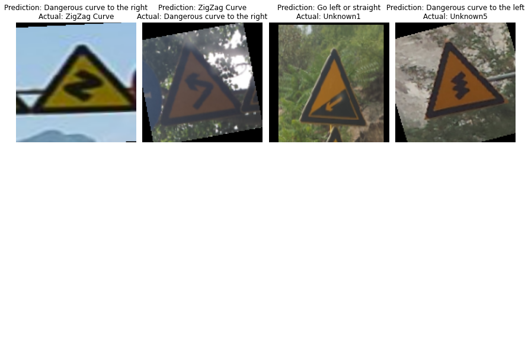

# traffic-signs-v1
A tensorflow implementation to detect traffic signs which can be used in SOAR development for car path planning.

```
%matplotlib inline

import os
import glob
from pathlib import Path
import ssl

import pandas as pd
import numpy as np
import matplotlib.pyplot as plt
import seaborn as sns

from sklearn.metrics import confusion_matrix, classification_report
from sklearn.model_selection import train_test_split

import tensorflow as tf
import tensorflow_model_optimization as tfmot
import tensorflow_datasets as tfds


# if using remote server
current_path = os.path.basename(os.path.normpath(os.getcwd()))
DIR = "traffic-signs-v1"
if(current_path != DIR):
	os.chdir(DIR)

SEED=1
BATCH_SIZE=64
INPUT_DIR = "./input/"
DATA_DIR = f"{INPUT_DIR}/traffic_Data/DATA/"
IMG_WH = 128

#tf.random.set_seed(SEED)

tf.config.set_visible_devices([], 'GPU') # hide gpus

gpus = tf.config.experimental.list_physical_devices('GPU')
for gpu in gpus:
    print("Name:", gpu.name, "  Type:", gpu.device_type)

# gpu optimizations
tf.config.optimizer.set_jit(True)

# with tf.device('/gpu:0'):
#     a = tf.constant([2.0, 2.0, 3.0, 4.0, 5.0, 6.0], shape=[2, 3], name='a')
#     b = tf.constant([1.0, 2.0, 3.0, 5.0, 5.0, 6.0], shape=[3, 2], name='b')
#     c = tf.matmul(a, b)

# tf.compat.v1.disable_eager_execution()
# with tf.compat.v1.Session() as sess:
#     print (sess.run(c))
```

    Name: /physical_device:GPU:0   Type: GPU


```
labels_df = pd.read_csv(f'{INPUT_DIR}labels.csv')
print(labels_df.head())

#Create a label map
label_map = dict(labels_df.values)
print(len(label_map))
```

       ClassId                  Name
    0        0   Speed limit (5km/h)
    1        1  Speed limit (15km/h)
    2        2  Speed limit (30km/h)
    3        3  Speed limit (40km/h)
    4        4  Speed limit (50km/h)
    58


```
image_list = list(Path(DATA_DIR).glob(r'**/*.png'))
labels = list(map(lambda path: os.path.split(os.path.split(path)[0])[1], image_list))

#Create dataframe with path of images and labels
image_series = pd.Series(image_list).astype(str)
labels_series = pd.Series(labels).astype(str)
frame = {'image':image_series, 'label':labels_series}
image_df = pd.DataFrame(frame)
print(image_df.sample(5))
```

                                              image label
    1253  input\traffic_Data\DATA\26\026_1_0015.png    26
    2587  input\traffic_Data\DATA\38\038_1_0003.png    38
    1503    input\traffic_Data\DATA\28\028_0173.png    28
    2103    input\traffic_Data\DATA\30\030_0023.png    30
    724   input\traffic_Data\DATA\16\016_1_0006.png    16


```
count_labels = image_df.groupby(['label']).size()
plt.figure(figsize=(17,5))
plt.ylabel('count images')
sns.barplot(x=count_labels.index, y=count_labels, palette="rocket")
```


    <AxesSubplot:xlabel='label', ylabel='count images'>


    

    


```
SPLIT_MINIMUM_COUNT = 10
```


```
def split_dataset(df, rate=SPLIT_MINIMUM_COUNT):
	"""
	Allocate a  dataset that has at least SPLIT_MINIMUM_COUNT_IMAGES of images
	
	split_df: dataframe for train
	train1_df: dataframe for drop
	"""

	count_labels = df.groupby(['label']).size()
	count_labels_df = count_labels.to_frame(name='count_images').reset_index()

	drop_label_list = list(
		count_labels_df['label'].\
		loc[count_labels_df['count_images']<SPLIT_MINIMUM_COUNT]
	)

	drop_df = df.copy()
	split_df = df.copy()

	for index, row in df.iterrows():
		if str(row.label) in drop_label_list:
			split_df = split_df.drop(index)
		else:
			drop_df = drop_df.drop(index)

	return split_df, drop_df

def custom_train_test_split(df):

	labels = df.label.unique()
	test_df = pd.DataFrame()

	for label in labels:
		label_samples = df.loc[df.label==label]
		test_df = pd.concat([test_df,label_samples.sample(len(label_samples)//10+1,random_state=SEED)])
	
	train_df = df.drop(list(test_df.index), axis=0)
	test_df = test_df.sample(frac=1, random_state=SEED)
	train_df = train_df.sample(frac=1, random_state=SEED)

	return train_df, test_df

image_df, _ = split_dataset(image_df)
#train_df, test_df = custom_train_test_split(split_df)
train, val = custom_train_test_split(image_df)
```


```
train_labels = train.groupby(['label']).size()
NUM_CLASSES = len(train_labels)
print(NUM_CLASSES)
```

    49


```
train_generator = tf.keras.preprocessing.image.ImageDataGenerator(
    preprocessing_function=tf.keras.applications.efficientnet.preprocess_input,
    rotation_range = 20,
    width_shift_range=0.1,
    height_shift_range=0.1,
    fill_mode='constant',
    #shear_range=0.2,
    zoom_range=0.3,
	rescale=1./255
)
```


```
train_dataset = train_generator.flow_from_dataframe(
    dataframe=train,
    x_col='image',
    y_col='label',
    color_mode='rgb',
    class_mode='categorical',
    target_size=(IMG_WH, IMG_WH),
    batch_size=BATCH_SIZE,
    shuffle=True,
    #seed=SEED
)

val_dataset = train_generator.flow_from_dataframe(
    dataframe=val,
    x_col='image',
    y_col='label',
    color_mode='rgb',
    class_mode='categorical',
    target_size=(IMG_WH, IMG_WH),
    batch_size=BATCH_SIZE,
    shuffle=True,
    #seed=SEED,
)
```

    Found 3683 validated image filenames belonging to 49 classes.
    Found 443 validated image filenames belonging to 49 classes.


```
map_labels = (train_dataset.class_indices)
map_labels = dict((v,k) for k,v in map_labels.items())

def model_to_label(n):
	return label_map[int(map_labels[np.argmax(n, axis=0)])]
```


```
#plot images
fig, axes = plt.subplots(2,4, figsize=(16, 7))
images, labels = train_dataset[0] # first batch
images2, labels2 = val_dataset[0] # first batch
for idx, ax in enumerate(axes.flat):
	if(idx < 4):
		image, label = images[idx], labels[idx]
	if(idx >= 4):
		image, label = images2[idx], labels2[idx]
	ax.imshow(image)
	ax.set_title(model_to_label(label))
	ax.axis("off")
plt.tight_layout()
plt.show()
```


    

    


```
#create model
def create_model(input_shape=(IMG_WH,IMG_WH,3,)):
	"""
	load EfficientNet without last layer and 
	add Dense and ouput Dense with NUM_CLASSES units

	"""

	layers = tf.keras.layers
	model = tf.keras.Sequential()

	model.add(layers.Input(shape=input_shape))
	model.add(layers.BatchNormalization())

	# base_model = tf.keras.applications.VGG16(
	# 	include_top=False,
	# 	weights='imagenet',
	# 	input_tensor = input_tensor
	# )
	# base_model.trainable = False
	# model.add(base_model)
	# #model.add(input_tensor)

	# model.add(layers.Flatten())
	# model.add(layers.Dense(units=512, activation="relu"))
	# model.add(layers.Dense(units=256, activation="relu"))

	model.add(layers.Conv2D(filters=64, kernel_size=5, activation="relu", padding="same"))
	model.add(layers.MaxPool2D(pool_size=2))
	model.add(layers.Conv2D(filters=64, kernel_size=5, activation="relu", padding="same"))
	model.add(layers.MaxPool2D(pool_size=2))
	model.add(layers.Dropout(0.2))

	model.add(layers.Conv2D(filters=128, kernel_size=3, activation="relu", padding="same"))
	model.add(layers.MaxPool2D(pool_size=2))
	model.add(layers.Conv2D(filters=128, kernel_size=3, activation="relu", padding="same"))
	model.add(layers.MaxPool2D(pool_size=2))
	model.add(layers.Dropout(0.2))

	model.add(layers.Conv2D(filters=256, kernel_size=3, activation="relu", padding="same"))
	model.add(layers.MaxPool2D(pool_size=2))
	model.add(layers.Conv2D(filters=256, kernel_size=3, activation="relu", padding="same"))
	model.add(layers.MaxPool2D(pool_size=2))
	model.add(layers.Dropout(0.2))

	model.add(layers.Conv2D(filters=512, kernel_size=3, activation="relu", padding="same"))
	model.add(layers.MaxPool2D(pool_size=2))
	model.add(layers.Dropout(0.2))

	model.add(layers.Flatten())

	model.add(layers.Dense(units=512, activation="relu"))
	model.add(layers.Dense(units=128, activation="relu"))
	
	model.add(layers.Dropout(0.2))
	model.add(layers.Dense(NUM_CLASSES, activation='softmax'))
		
	return model
```


```
model = create_model()
#optimizer = tf.keras.optimizers.SGD(learning_rate=0.01)

model.compile(
    optimizer='adam',
    loss='categorical_crossentropy',
    metrics=['acc'],
)
```


```
callbacks = [
	tf.keras.callbacks.EarlyStopping(patience=5, monitor='val_loss', restore_best_weights=True),
	tf.keras.callbacks.ReduceLROnPlateau(monitor='val_loss', min_lr=1e-7, patience=2, mode='min', verbose=1, factor=0.1),
]

with tf.device('/gpu:0'):
	history = model.fit(
		train_dataset,
		epochs=100,
		validation_data=val_dataset,
		callbacks=callbacks
	)
```

    Epoch 1/100
    58/58 [==============================] - 21s 323ms/step - loss: 3.4061 - acc: 0.1045 - val_loss: 3.5217 - val_acc: 0.1196 - lr: 0.0010
    Epoch 2/100
    58/58 [==============================] - 19s 323ms/step - loss: 2.7139 - acc: 0.2384 - val_loss: 2.7038 - val_acc: 0.2889 - lr: 0.0010
    Epoch 3/100
    58/58 [==============================] - 15s 253ms/step - loss: 2.3225 - acc: 0.3416 - val_loss: 2.4355 - val_acc: 0.3770 - lr: 0.0010
    Epoch 4/100
    58/58 [==============================] - 15s 253ms/step - loss: 1.8929 - acc: 0.4268 - val_loss: 1.7231 - val_acc: 0.4582 - lr: 0.0010
    Epoch 5/100
    58/58 [==============================] - 15s 254ms/step - loss: 1.6887 - acc: 0.4632 - val_loss: 1.6464 - val_acc: 0.4786 - lr: 0.0010
    Epoch 6/100
    58/58 [==============================] - 15s 253ms/step - loss: 1.5218 - acc: 0.4923 - val_loss: 1.5210 - val_acc: 0.5395 - lr: 0.0010
    Epoch 7/100
    58/58 [==============================] - 15s 254ms/step - loss: 1.4288 - acc: 0.5246 - val_loss: 1.4058 - val_acc: 0.5418 - lr: 0.0010
    Epoch 8/100
    58/58 [==============================] - 15s 253ms/step - loss: 1.2866 - acc: 0.5612 - val_loss: 1.1997 - val_acc: 0.5937 - lr: 0.0010
    Epoch 9/100
    58/58 [==============================] - 15s 251ms/step - loss: 1.1621 - acc: 0.6106 - val_loss: 1.1607 - val_acc: 0.6185 - lr: 0.0010
    Epoch 10/100
    58/58 [==============================] - 15s 249ms/step - loss: 1.0618 - acc: 0.6364 - val_loss: 0.9142 - val_acc: 0.6862 - lr: 0.0010
    Epoch 11/100
    58/58 [==============================] - 18s 309ms/step - loss: 0.8788 - acc: 0.6973 - val_loss: 0.7902 - val_acc: 0.7065 - lr: 0.0010
    Epoch 12/100
    58/58 [==============================] - 15s 250ms/step - loss: 0.8246 - acc: 0.7187 - val_loss: 0.7495 - val_acc: 0.7336 - lr: 0.0010
    Epoch 13/100
    58/58 [==============================] - 15s 256ms/step - loss: 0.7876 - acc: 0.7277 - val_loss: 0.6521 - val_acc: 0.7923 - lr: 0.0010
    Epoch 14/100
    58/58 [==============================] - 17s 293ms/step - loss: 0.7370 - acc: 0.7464 - val_loss: 0.6372 - val_acc: 0.7833 - lr: 0.0010
    Epoch 15/100
    58/58 [==============================] - 15s 250ms/step - loss: 0.7061 - acc: 0.7757 - val_loss: 0.6046 - val_acc: 0.7923 - lr: 0.0010
    Epoch 16/100
    58/58 [==============================] - 17s 249ms/step - loss: 0.6359 - acc: 0.7961 - val_loss: 0.5962 - val_acc: 0.8036 - lr: 0.0010
    Epoch 17/100
    58/58 [==============================] - 19s 330ms/step - loss: 0.5481 - acc: 0.8224 - val_loss: 0.4964 - val_acc: 0.8375 - lr: 0.0010
    Epoch 18/100
    58/58 [==============================] - 15s 249ms/step - loss: 0.5575 - acc: 0.8241 - val_loss: 0.4355 - val_acc: 0.8600 - lr: 0.0010
    Epoch 19/100
    58/58 [==============================] - 15s 253ms/step - loss: 0.4804 - acc: 0.8439 - val_loss: 0.3542 - val_acc: 0.8894 - lr: 0.0010
    Epoch 20/100
    58/58 [==============================] - 15s 251ms/step - loss: 0.4298 - acc: 0.8594 - val_loss: 0.4429 - val_acc: 0.8713 - lr: 0.0010
    Epoch 21/100
    58/58 [==============================] - ETA: 0s - loss: 0.3969 - acc: 0.8765
    Epoch 21: ReduceLROnPlateau reducing learning rate to 0.00010000000474974513.
    58/58 [==============================] - 15s 253ms/step - loss: 0.3969 - acc: 0.8765 - val_loss: 0.3739 - val_acc: 0.8916 - lr: 0.0010
    Epoch 22/100
    58/58 [==============================] - 15s 251ms/step - loss: 0.3305 - acc: 0.8938 - val_loss: 0.2779 - val_acc: 0.9278 - lr: 1.0000e-04
    Epoch 23/100
    58/58 [==============================] - 15s 249ms/step - loss: 0.2788 - acc: 0.9101 - val_loss: 0.2454 - val_acc: 0.9255 - lr: 1.0000e-04
    Epoch 24/100
    58/58 [==============================] - 15s 251ms/step - loss: 0.2557 - acc: 0.9202 - val_loss: 0.2234 - val_acc: 0.9323 - lr: 1.0000e-04
    Epoch 25/100
    58/58 [==============================] - 15s 250ms/step - loss: 0.2449 - acc: 0.9199 - val_loss: 0.2066 - val_acc: 0.9368 - lr: 1.0000e-04
    Epoch 26/100
    58/58 [==============================] - 15s 252ms/step - loss: 0.2611 - acc: 0.9158 - val_loss: 0.2155 - val_acc: 0.9278 - lr: 1.0000e-04
    Epoch 27/100
    58/58 [==============================] - ETA: 0s - loss: 0.2244 - acc: 0.9245
    Epoch 27: ReduceLROnPlateau reducing learning rate to 1.0000000474974514e-05.
    58/58 [==============================] - 15s 253ms/step - loss: 0.2244 - acc: 0.9245 - val_loss: 0.2141 - val_acc: 0.9368 - lr: 1.0000e-04
    Epoch 28/100
    58/58 [==============================] - 15s 252ms/step - loss: 0.2259 - acc: 0.9280 - val_loss: 0.2150 - val_acc: 0.9278 - lr: 1.0000e-05
    Epoch 29/100
    58/58 [==============================] - 15s 253ms/step - loss: 0.2197 - acc: 0.9283 - val_loss: 0.2012 - val_acc: 0.9368 - lr: 1.0000e-05
    Epoch 30/100
    58/58 [==============================] - 15s 253ms/step - loss: 0.2094 - acc: 0.9318 - val_loss: 0.2123 - val_acc: 0.9368 - lr: 1.0000e-05
    Epoch 31/100
    58/58 [==============================] - ETA: 0s - loss: 0.2277 - acc: 0.9245
    Epoch 31: ReduceLROnPlateau reducing learning rate to 1.0000000656873453e-06.
    58/58 [==============================] - 15s 253ms/step - loss: 0.2277 - acc: 0.9245 - val_loss: 0.2139 - val_acc: 0.9300 - lr: 1.0000e-05
    Epoch 32/100
    58/58 [==============================] - 18s 300ms/step - loss: 0.2090 - acc: 0.9354 - val_loss: 0.2183 - val_acc: 0.9278 - lr: 1.0000e-06
    Epoch 33/100
    58/58 [==============================] - 17s 293ms/step - loss: 0.2237 - acc: 0.9270 - val_loss: 0.2008 - val_acc: 0.9368 - lr: 1.0000e-06
    Epoch 34/100
    58/58 [==============================] - 15s 253ms/step - loss: 0.2115 - acc: 0.9324 - val_loss: 0.2104 - val_acc: 0.9300 - lr: 1.0000e-06
    Epoch 35/100
    58/58 [==============================] - 15s 252ms/step - loss: 0.2250 - acc: 0.9253 - val_loss: 0.1884 - val_acc: 0.9391 - lr: 1.0000e-06
    Epoch 36/100
    58/58 [==============================] - 17s 292ms/step - loss: 0.2161 - acc: 0.9297 - val_loss: 0.2303 - val_acc: 0.9210 - lr: 1.0000e-06
    Epoch 37/100
    58/58 [==============================] - 17s 294ms/step - loss: 0.2112 - acc: 0.9340 - val_loss: 0.1815 - val_acc: 0.9391 - lr: 1.0000e-06
    Epoch 38/100
    58/58 [==============================] - 15s 252ms/step - loss: 0.2177 - acc: 0.9248 - val_loss: 0.2151 - val_acc: 0.9345 - lr: 1.0000e-06
    Epoch 39/100
    58/58 [==============================] - ETA: 0s - loss: 0.2229 - acc: 0.9264
    Epoch 39: ReduceLROnPlateau reducing learning rate to 1.0000001111620805e-07.
    58/58 [==============================] - 15s 251ms/step - loss: 0.2229 - acc: 0.9264 - val_loss: 0.2026 - val_acc: 0.9368 - lr: 1.0000e-06
    Epoch 40/100
    58/58 [==============================] - 15s 249ms/step - loss: 0.2289 - acc: 0.9286 - val_loss: 0.2016 - val_acc: 0.9413 - lr: 1.0000e-07
    Epoch 41/100
    58/58 [==============================] - ETA: 0s - loss: 0.2130 - acc: 0.9302
    Epoch 41: ReduceLROnPlateau reducing learning rate to 1e-07.
    58/58 [==============================] - 15s 251ms/step - loss: 0.2130 - acc: 0.9302 - val_loss: 0.2068 - val_acc: 0.9368 - lr: 1.0000e-07
    Epoch 42/100
    58/58 [==============================] - 15s 250ms/step - loss: 0.2209 - acc: 0.9272 - val_loss: 0.2092 - val_acc: 0.9210 - lr: 1.0000e-07


```
# Pruning
score = model.evaluate(val_dataset, verbose=0)
print(f'Regular CNN - Test loss: {score[0]} / Test accuracy: {score[1]}')

# Load functionality for adding pruning wrappers
prune_low_magnitude = tfmot.sparsity.keras.prune_low_magnitude

# Finish pruning after 5 epochs
pruning_epochs = 5
num_images = len(train_dataset[0][0])
end_step = np.ceil(num_images / BATCH_SIZE).astype(np.int32) * pruning_epochs

# Define pruning configuration
pruning_params = {
      'pruning_schedule': tfmot.sparsity.keras.PolynomialDecay(initial_sparsity=0.40,
                                                               final_sparsity=0.70,
                                                               begin_step=0,
                                                               end_step=end_step)
}
model_fast = prune_low_magnitude(model, **pruning_params)

# Recompile the model
model_fast.compile(loss=tf.keras.losses.categorical_crossentropy,
              optimizer=tf.keras.optimizers.Adam(),
              metrics=['accuracy'])

# Model callbacks
callbacks = [
	tfmot.sparsity.keras.UpdatePruningStep()
]

# Fitting data
with tf.device('/gpu:0'):
	model_fast.fit(train_dataset,
						batch_size=BATCH_SIZE,
						epochs=pruning_epochs,
						callbacks=callbacks,
						validation_data=val_dataset,
						)

# Generate generalization metrics
score_pruned = model_fast.evaluate(val_dataset, verbose=0)
print(f'Pruned CNN - Test loss: {score_pruned[0]} / Test accuracy: {score_pruned[1]}')
print(f'Regular CNN - Test loss: {score[0]} / Test accuracy: {score[1]}')
```

    Regular CNN - Test loss: 0.1961604803800583 / Test accuracy: 0.9367945790290833
    Epoch 1/5
    58/58 [==============================] - 21s 263ms/step - loss: 0.3495 - accuracy: 0.8876 - val_loss: 0.3720 - val_accuracy: 0.8871
    Epoch 2/5
    58/58 [==============================] - 16s 274ms/step - loss: 0.4132 - accuracy: 0.8781 - val_loss: 0.2603 - val_accuracy: 0.9255
    Epoch 3/5
    58/58 [==============================] - 16s 271ms/step - loss: 0.3399 - accuracy: 0.8947 - val_loss: 0.2680 - val_accuracy: 0.9029
    Epoch 4/5
    58/58 [==============================] - 15s 264ms/step - loss: 0.3354 - accuracy: 0.9023 - val_loss: 0.2764 - val_accuracy: 0.9120
    Epoch 5/5
    58/58 [==============================] - 15s 262ms/step - loss: 0.2893 - accuracy: 0.9139 - val_loss: 0.2264 - val_accuracy: 0.9278
    Pruned CNN - Test loss: 0.19721156358718872 / Test accuracy: 0.9300225973129272
    Regular CNN - Test loss: 0.1961604803800583 / Test accuracy: 0.9367945790290833


```
try:
    old_history
except NameError:
    old_history = history

plt.figure(figsize=(5,3))
plt.plot(history.history['acc'], label='train_acc')
plt.plot(history.history['val_acc'], label='val_acc')
plt.plot(old_history.history['acc'], label='train_acc', alpha=0.2)
plt.plot(old_history.history['val_acc'], label='val_acc', alpha=0.2)
plt.title('Accuracy plot')
plt.xlabel('epochs')
plt.ylabel('Accuracy')
plt.ylim(top=1)

# plot maximum point
ymax = max(history.history['val_acc'])
xpos = history.history['val_acc'].index(ymax)

plt.annotate(round(ymax,4), xy=(xpos, ymax), xytext=(xpos, 1.1), arrowprops=dict(facecolor='black'))
plt.annotate(round(ymax,4), xy=(xpos, ymax), xytext=(xpos, 1.2), arrowprops=dict(facecolor='black'), alpha=0.2)


plt.legend()
plt.show()

plt.figure(figsize=(5,3))
plt.plot(history.history['loss'], label='loss')
plt.plot(history.history['val_loss'], label='val_loss')
plt.plot(old_history.history['loss'], label='loss', alpha=0.2)
plt.plot(old_history.history['val_loss'], label='val_loss', alpha=0.2)
plt.title('Loss plot')
plt.xlabel('epochs')
plt.ylabel('Loss')
plt.legend()
plt.show()

old_history = history
```


    

    


    

    


```
predictions = model_fast.predict(val_dataset[0][0])

wrong_info = [[val_dataset[0][0][i],model_to_label(predictions[i]),model_to_label(val_dataset[0][1][i])] for i,v in enumerate(predictions) if np.argmax(predictions[i])!=np.argmax(val_dataset[0][1][i], axis=0)]
```

    2/2 [==============================] - 1s 47ms/step


```
#plot wrong images and their labels
if(len(wrong_info) > 0):
	fig, axes = plt.subplots(len(wrong_info)//4+1, min(len(wrong_info), 4),figsize=(12, 9))
	for idx, ax in enumerate(axes.flat):
		if(len(wrong_info) <= idx):
			ax.axis("off")
			continue
		wimage, wlabel, rlabel = wrong_info[idx]
		ax.imshow(wimage)
		ax.set_title("Prediction: "+wlabel+"\n"+"Actual: "+rlabel)
		ax.axis("off")
	plt.tight_layout()
	plt.show()
else:
	print("Zero errors in batch 1")
```


    

